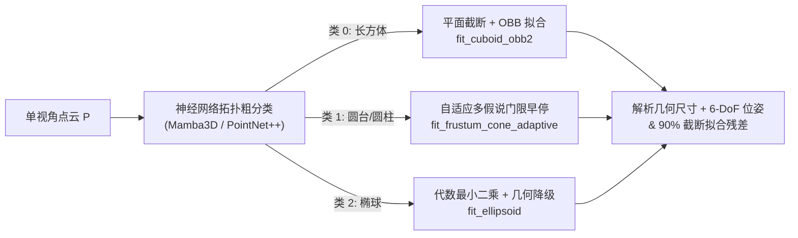

# 基于图元几何先验的精细几何建模与拓扑分类 (GPBSF)
**Geometric Primitive-Based Shape Fitting for Scene Objects**

本项目对应博士学位论文**第四章“基于图元几何先验的未建模未知物体精细几何建模与拓扑分类”**的核心工程实现与实验复现套件。

---

## 1. 项目概述与架构设计

在复杂非结构化工业与服务场景中，待抓取未知工件往往未预先构建高精度 CAD 资产，且单视角深度相机存在天然的视线自遮挡与点云缺失。传统基于稠密网格重构或神经辐射场的方法解算耗时长、易产生浮点伪影，难以直接导出适于夹爪闭合接触分析的解析流形。

本代码库（GPBSF: Geometric Primitive-Based Shape Fitting）提出了以**三类正交图元（长方体、圆台、椭球）**为几何骨架的建模范式：
1. **拓扑粗分类（Coarse Topological Classification）**：采用 Mamba3D / PointNet++ 等轻量级三维骨干网络，将未建模工件的单视角残差点云判定为基础几何族（0: 长方体，1: 圆锥/圆台/圆柱，2: 椭球/旋转对称曲面）。
2. **精细图元几何拟合（Fine Primitive Fitting）**：针对判定的几何族，触发专门优化的代数与几何解析求解器，输出物体的解析几何尺寸与 6-DoF 刚体位姿（$\mathbf{T} \in \mathrm{SE}(3)$）。
3. **闭环自适应早停（Adaptive Early-Exit）**：通过前 90% 鲁棒截断曲面贴合距离（Trimmed Distance）实时度量残差，以 2.0 mm 物理容忍门限实现假说早停。



---

## 2. 核心算法体系

### 2.1 长方体拟合 (`fit_cuboid_obb2` & `fit_cuboid_obb`)
- **平面截断对齐**：首先利用 RANSAC 算法提取点云中的最大主支撑平面法向量作为基准参考轴；
- **局部投影与分位数包围盒**：将所有观测点投影至主平面局部正交系中，采用 0.5%--99.5% 稳健分位数截断滤除激光/深度相机边缘拉丝与飞点噪点；
- **异常退化保底**：当主平面内点数不足（< 20 点）时，自动平滑退化至三维最小定向包围盒（Oriented Bounding Box, OBB）。

### 2.2 圆锥/圆台自适应拟合 (`fit_frustum_cone_adaptive`)
对应论文**算法 4.1（基于多假设与门限早停的自适应圆台拟合算法）**：
- **假说生成与优先级排序**：
  1. `pca_z0`：主成分分析最大主方向轴（适用于细长瓶身、管件）；
  2. `pca_z2`：主成分分析次主方向轴（适用于浅碗、扁平盒体）；
  3. `normal`：表面法向量聚类与端面平面截断；
  4. `normal_ransac`：基于法向量正交性与夹角方差最小化的 RANSAC 轴线求解；
  5. `obb`：全局最小定向包围盒对称轴。
- **快速切片圆回归**：对轴向旋转对齐后的点云沿轴线均匀切片，采用闭式代数解 Kåsa 快速圆拟合算法计算各层半径，辅以线性 RANSAC 回归求解顶底半径与中心；
- **极速门限早停**：一旦某个假说的 90% 截断拟合残差 $\le \tau_{\mathrm{cone}} = 2.0\,\mathrm{mm}$，立即早停返回，将单物体拟合延迟压低至毫秒级。

### 2.3 椭球代数与几何两级拟合 (`fit_ellipsoid`)
- **一级求解（RANSAC 代数直接最小二乘）**：通过 SVD 求解二次曲面隐式方程系数矩阵，经解析特征值分解还原椭球半轴长、球心坐标与姿态矩阵；
- **二级降级（几何约束最优化）**：若观测视场角缺失严重导致代数拟合出现负特征值或极度扁平退化，自动触发几何回退机制，基于 PCA 姿态粗对齐与带边界约束的非负最小二乘（NNLS）/ 软 L1 鲁棒信赖域算法（TRF）快速解算物理合理的半轴尺寸。

---

## 3. 实验指标与学术定义

在第四章评测中，严谨区分以下两类指标：

| 评估指标 | 符号与定义 | 物理意义与计算方式 |
| :--- | :--- | :--- |
| **全曲面真值重建误差 (mm)**<br>*(Reconstruction Error)* | $D_{\mathrm{full}}(\widehat{\mathcal{S}}, \mathcal{S}_{\mathrm{gt}})$ | 评价算法由单视角不完整观测推断未知物体**完整物理实体曲面**的能力。在真值参数曲面与拟合图元曲面上均匀独立采样各 4,096 点，计算其双向最近邻曲面均值。 |
| **90% 截断拟合残差 (mm)**<br>*(90% Trimmed Distance)* | $d_{\mathrm{trimmed}}(\mathcal{P}, \widehat{\mathcal{S}})$ | 评价拟合图元表面与**实际可见观测点云**的几何吻合程度。计算观测点云向拟合曲面的最近邻距离，截取距离最近的前 90% 内点计算均值，剔除边缘离群飞点。 |

---

## 4. 环境依赖与配置

本代码库分为两层环境要求：

### 4.1 几何图元拟合与评测基础环境（纯 Python 科学计算栈）
支持 **Windows PowerShell** 与 **Linux Bash**，无需复杂 CUDA 扩展：
```bash
pip install numpy scipy open3d spatialmath-python scikit-learn
```

### 4.2 神经网络分类训练与推断环境（Linux / WSL2 + CUDA）
用于复现表 4.2 的 Mamba3D / PointNet++ 拓扑分类实验矩阵：
```bash
# 1. 初始化并更新子模块
git submodule update --init --recursive

# 2. 安装 Mamba3D 核心依赖
pip install torch torchvision
pip install -r submodels/mamba3d/requirements.txt
pip install causal-conv1d==1.1.1 mamba-ssm==1.1.1
```

---

## 5. 第四章学术实验完整复现指南

以下所有命令在代码根目录 `code/GPBSF` 下执行。

### 5.1 生成基准点云数据集 BGSPCD-v4-robust
生成包含 1,800 个几何族、共计 30,400 个样本（训练集 23,040，验证集 2,720，测试集 4,640）的高保真单视角点云基准数据集：
```bash
python -m experiments.bgspcd.robust --config config/experiments/bgspcd_v4_robust.json
```

### 5.2 神经网络拓扑分类实验 (复现表 4.2)
在多随机种子（3407, 3408, 3409）下运行 Mamba3D 与 PointNet++ 的三分类训练及评测：

```bash
# 运行 Mamba3D 分类矩阵
python scripts/run_classification_matrix.py \
  --models mamba3d \
  --seeds 3407 3408 3409 \
  --config config/experiments/classification_v4_robust.json

# 运行 PointNet++ 基线矩阵
python scripts/run_classification_matrix.py \
  --models pointnet2 \
  --seeds 3407 3408 3409 \
  --config config/experiments/classification_v4_robust.json

# 汇总测试集分类指标 (Accuracy, Macro-F1)
python -m experiments.classification.cli \
  --config config/experiments/classification_v4_robust.json \
  aggregate --runs-dir runs/classification_v4_robust
```

### 5.3 几何图元拟合精度定量评估 (复现表 4.3 基础数据)
使用测试集真实几何真值引导（Ground Truth Oracle Routing），隔离分类错误，独立评估几何图元拟合求解器的核心性能：

```bash
python -m experiments.fitting.evaluate \
  --manifest data/bgspcd_v4_robust/manifest.jsonl \
  --split test \
  --output runs/fitting/v4_robust_oracle_test.csv \
  --export-fallback-log runs/fitting/fallback_triggers.csv
```

### 5.4 自动化生成表 4.3 LaTeX 报表
由上述评测生成的 `v4_robust_oracle_test.summary.json` 和 `v4_robust_oracle_test.csv`，一键生成符合博士学位论文规范的 LaTeX 表格代码与中英文对照报表：

```bash
python experiments/fitting/format_table43.py \
  --summary runs/fitting/v4_robust_oracle_test.summary.json \
  --csv runs/fitting/v4_robust_oracle_test.csv
```

生成的报表结构严格对应博士论文表 4.3：
- **类别 (Class)**：长方体 (Cuboid)、圆台 (Frustum Cone)、椭球 (Ellipsoid)、整体 (Overall)；
- **拟合成功率 (Fit Success Rate)**；
- **全曲面真值重建误差 (mm)**：中位数 (Median) 与 90 分位数 (P90)；
- **90% 截断拟合残差 (mm)**：中位数 (Median) 与 90 分位数 (P90)；
- **几何参数相对误差 (Size Rel Err)**；
- **平均耗时 (Latency, ms)**。

---

## 6. 独立点云图元拟合演示 (CLI)

可以使用 `main.py` 对任意离线点云文件进行拟合测试：

### 6.1 自动多图元竞争拟合
```bash
python main.py --pcd data/bgspcd/cone/cone_0000.txt --cls auto
```

### 6.2 定向拟合特定图元
```bash
# 拟合长方体 (平面截断 + OBB)
python main.py --pcd sample.ply --cls 0

# 拟合自适应圆台
python main.py --pcd sample.ply --cls 1 --tau-cone 2.0

# 拟合椭球
python main.py --pcd sample.ply --cls 2
```

### 6.3 启用 Open3D 3D 窗口交互可视化
添加 `--visualize` 参数即可同屏渲染原始点云（蓝色）、拟合图元解析曲面（绿色）与 6-DoF 刚体坐标轴：
```bash
python main.py --pcd sample.ply --cls auto --visualize
```

---

## 7. 仓库文件组织结构

```
code/GPBSF/
├── shape_fitting/               # 核心解析几何图元拟合算法包
│   ├── __init__.py              # 导出 FittingByBGS, fit_* 等核心 API
│   ├── fitting.py               # 长方体、自适应圆台、两级椭球拟合求解器与调度器
│   └── pointcloud.py            # 点云归一化、Kåsa 代数圆拟合、代数二次曲面模型与鲁棒截断距离
├── experiments/                 # 第四章学术复现实验套件
│   ├── bgspcd/
│   │   ├── dataset.py           # 仿真相机视锥投影与带约束退化采样器
│   │   └── robust.py            # BGSPCD-v4-robust 基准数据集生成器
│   ├── classification/          # Mamba3D / PointNet++ 拓扑分类训练、推断与评测
│   │   ├── adapters/            # 模型适配器 (Mamba3D / PointNet++)
│   │   ├── cli.py               # 分类实验 CLI
│   │   └── engine.py            # 训练与评估引擎
│   └── fitting/
│       ├── evaluate.py          # 图元拟合精度评测脚本 (Oracle Routing)
│       └── format_table43.py    # 表 4.3 自动化 LaTeX 与 Markdown 报表生成器
├── main.py                      # 独立点云图元拟合 CLI 工具与交互演示入口
├── sam.py                       # SAM 分割工具封装 (用于交互演示)
└── config/experiments/          # 实验配置文件 (数据集、网络架构与超参数)
```

---

## 8. 引用与致谢

本代码库作为博士学位论文研究支撑开源，拟合算法在后续研究中作为先验特征直接支撑第五章语言引导多图元对称位姿流形抓取规划（LGGPF）系统。
